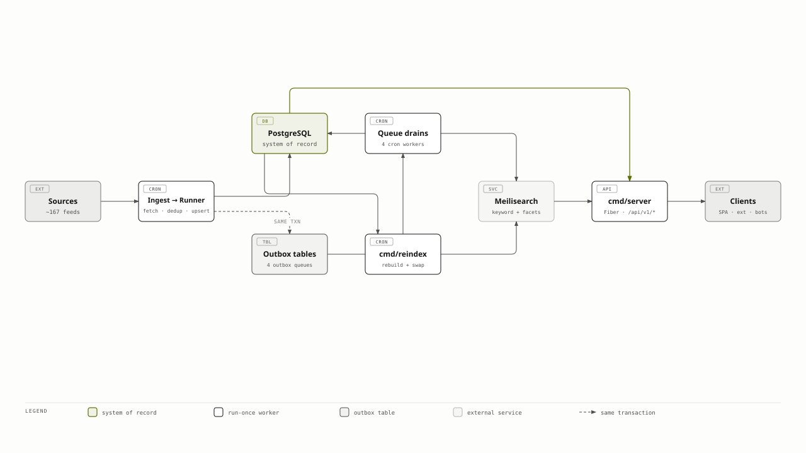
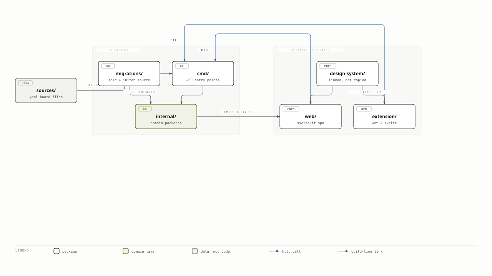
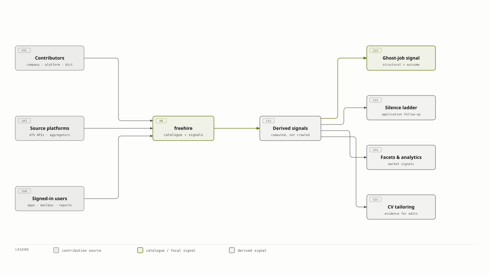
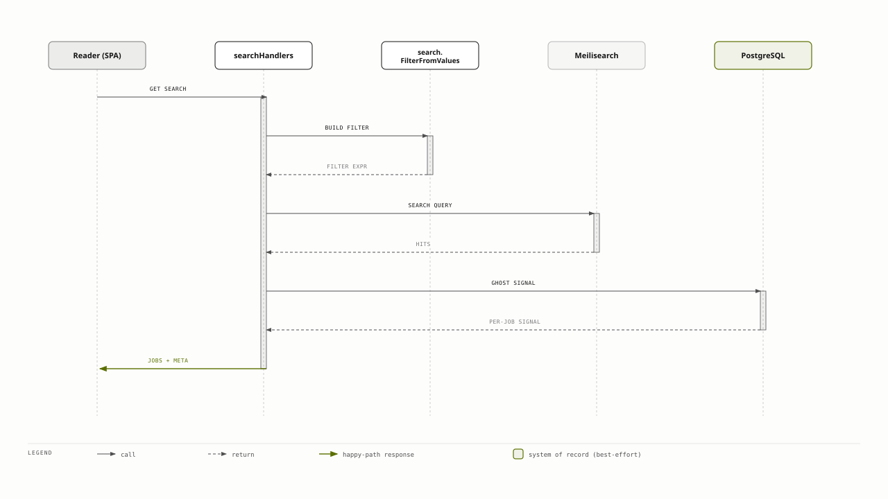
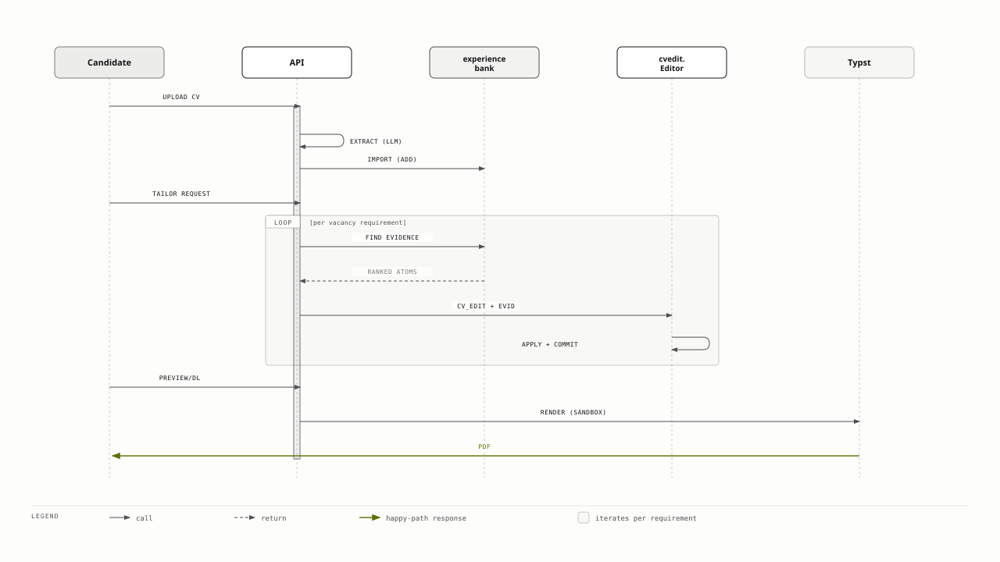
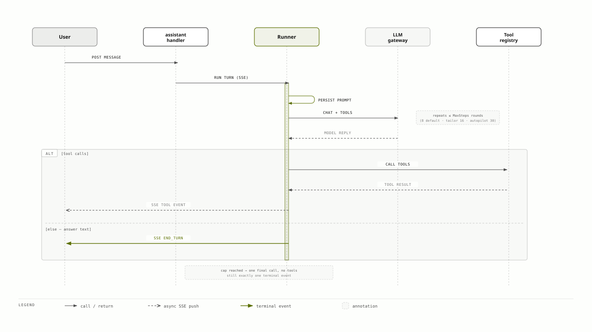

# freehire architecture

A map of how freehire fits together: where a job posting enters the system, what happens to it on the way to a search result, and what the surfaces built on top of that catalogue — the CV workspace, the application tracker, the in-app assistant — are actually made of.

This is the **map**. The territory is the per-package `AGENTS.md` files, which carry the invariants, the traps, and the reasoning behind specific decisions. Every section here ends with pointers into them. If you want to know *what freehire does* rather than how it is built, [`docs/features.md`](features.md) is the feature reference, and the endpoint documentation lives at [freehire.me/docs/api](https://freehire.me/docs/api) — neither is reproduced here.

You do not need to read Go to follow this document.

## Contents

- [The shape of the system](#the-shape-of-the-system)
- [The repository](#the-repository)
- [The ecosystem](#the-ecosystem)
- [Flow: finding a job](#flow-finding-a-job)
- [Flow: tailoring a CV](#flow-tailoring-a-cv)
- [Flow: asking the assistant](#flow-asking-the-assistant)
- [Auth model](#auth-model)
- [Notifications](#notifications)
- [Job lifecycle](#job-lifecycle)
- [Where to go deeper](#where-to-go-deeper)

## The shape of the system

freehire is a Go monolith with a satellite constellation of single-purpose workers. The HTTP server does one thing — serve the API, including the in-app assistant's request-time LLM calls — and every crawl, every background LLM call (enrichment, embeddings), every index rebuild happens in a **run-once-and-exit worker** that a cron schedule starts and that exits when its work is done. There is no job queue daemon and no long-lived background runtime; the only two processes that stay up are `cmd/server` and `cmd/mail-ingest`, the inbound-mail listener.

That choice shapes everything downstream. Because workers do not share memory with the server or with each other, all coordination happens in Postgres — which is why the write paths are full of **transactional outboxes**: a table row queued in the same transaction as the write that caused it, drained later by whichever worker owns that queue.

*Collapsed for readability: `Sources` folds the four crawl channels, `Queue drains` folds `cmd/enrich` · `cmd/search-drain` · `cmd/embed` · `cmd/capture-apply-form`, and `Clients` folds the SPA, extension, bots, and third-party API consumers. See each package's own `AGENTS.md` (linked below) for the full fan-out.*

**Ingest.** `cmd/ingest` takes one board file per run — `sources/greenhouse.yml`, `sources/lever.yml`, and so on — so each provider crawls on its own schedule and a slow platform never blocks a fast one. It validates every entry against the adapter registry and fails before any request goes out, then hands off to `pipeline.Runner`, which fetches each board once, normalizes postings into a single schema, deduplicates, and upserts. The dedup key is `jobs.UNIQUE (source, external_id)`, so re-running a crawl is free. A board that keeps failing backs off on a recorded cooldown rather than being hammered every run. The large majority of postings are crawled straight from an employer's own ATS or career page; aggregators and Telegram are a smaller supplementary slice of the same pipeline — see [README's Sources breakdown](../README.md#sources) for the exact split.

**Storage.** Postgres is the system of record for everything: the catalogue, accounts, CVs, applications, mail, assistant transcripts. Database access is generated by [sqlc](https://sqlc.dev/) from hand-written SQL — there is no ORM, and `internal/db/*.go` is generated code that is committed so the repo builds without sqlc installed. `migrations/` is the single source of truth for schema and feeds both sqlc's codegen and Postgres's first-boot initdb.

**Enrichment and indexing.** A crawl writes the posting and, in the same transaction, queues it: into `enrichment_outbox` if it is new, and into `search_outbox` if its content actually changed. That second condition matters — an unchanged re-crawl takes a cheap path that only refreshes a "last seen" timestamp, so the whole catalogue is not re-indexed every few hours. `cmd/enrich` drains the enrichment queue through an LLM behind a typed, validated contract; `cmd/search-drain` builds documents from the stored rows and pushes a whole claimed wave to Meilisearch as one task.

That batching is not a micro-optimisation. Meilisearch re-merges its inverted index across the *whole* live index on every push regardless of batch size — measured at 90–180 seconds per push on a ~2.7M-document index — so the earlier design, where ~169 independent per-board processes each pushed directly, saturated host disk IO. The outbox collapses many small pushes into few fat ones.

**Search.** One index. `jobs` is the keyword-and-facet index, and it stores the *complete public wire shape of a job*, not a pointer to one — which is why a search response needs no database round trip to render. `cmd/reindex` rebuilds it from scratch and swaps it in atomically — live reads are never affected by a rebuild — and remains the index's source of truth for settings, compaction, and the removal of closed-job documents. There is no semantic/hybrid search mode: a prior Meilisearch-backed `jobs_semantic` index was removed once its only two real consumers stopped needing a *live* index — `/jobs/:slug/similar` now reads a precomputed nearest-neighbour lookup (`jobs.similar_job_ids`, filled offline by `cmd/similar-backfill` from pgvector queries over `job_semantic_chunks`), and CV-based recommendations were dropped outright rather than migrated. `cmd/embed` still drains `semantic_outbox` (via TEI) into Postgres — writing only `job_semantic_chunks`, the table those pgvector queries read; a legacy single-vector column from the old scheme stays in the schema but is no longer written — but writes no search index.

**The API.** One Fiber server, one public wire shape. `internal/jobview` owns the single JSON representation of a job used by the list endpoint, the detail endpoint, and the search index alike, so those surfaces cannot drift apart. Responses use `{"data": ...}` for single items, `{"data": ..., "meta": {...}}` for lists, and `{"error": msg}` for failures. The catalogue is public and keyless — `GET https://freehire.me/api/v1/jobs` needs no credential.

Deeper: [`internal/pipeline`](../internal/pipeline/AGENTS.md) · [`internal/sources`](../internal/sources/AGENTS.md) · [`internal/search`](../internal/search/AGENTS.md) · [`internal/searchdrain`](../internal/searchdrain/AGENTS.md) · [`internal/db`](../internal/db/AGENTS.md) · [`internal/handler`](../internal/handler/AGENTS.md) · [`internal/jobview`](../internal/jobview/AGENTS.md)

## The repository

*`docs/` and `openspec/` are omitted from the diagram — they carry no code-level edges of their own.*

**`cmd/`** holds roughly sixty entry points. Two are long-lived: `cmd/server` and `cmd/mail-ingest`. Everything else — crawlers, queue drains, backfills, rollups, notification passes — takes `DATABASE_URL`, does one pass, and exits non-zero on failure. What keeps a cron worker from stacking on itself is systemd's `Type=oneshot`, not a file lock.

**`internal/`** is where the domain lives, one package per concern. The substantial ones carry an `AGENTS.md` stating what is always true about them; the table at the end of [`AGENTS.md`](../AGENTS.md) indexes all of them. Two conventions are worth knowing before reading any of it: `internal/db` is **generated** (edit `internal/db/queries/*.sql` and run `make sqlc`), and handlers are thin — they parse, call a service, and render, so a rule added to a handler is a rule the assistant's tools never meet, since those tools call the same services directly.

**`sources/`** is data, not code, and it is the file most contributions touch. One YAML file per ATS provider, one entry per company. Retiring a board means *moving* its line to `sources/retired/`, never deleting it — ingest takes one file by path, so the retirement is expressed by where the line lives and a mistake is undone by moving it back.

**`web/`** is the SvelteKit SPA, served same-origin with the API in production and proxied to it in development. It does not hand-maintain its view of the backend's types: `cmd/gen-contracts` generates `web/src/lib/generated/contracts.ts` from the Go wire structs and the closed vocabularies (source names, application stages, enrichment facets), so a value added in Go and missing from the SPA's maps is a TypeScript error rather than a blank cell that ships green.

**`design-system/`** is a sibling pnpm package linked into `web/` and `extension/` by symlink rather than copy — install it before building either consumer, because neither package manager installs a linked package's own dependencies for you.

Deeper: [`AGENTS.md`](../AGENTS.md) for the full module index · [`web/AGENTS.md`](../web/AGENTS.md) · [`design-system/AGENTS.md`](../design-system/AGENTS.md) · [`extension/AGENTS.md`](../extension/AGENTS.md) · [`CONTRIBUTING.md`](../CONTRIBUTING.md)

## The ecosystem

freehire is fed by three quite different kinds of contribution, and the system's shape reflects which of them is cheap and which is expensive.

*Each contributor category, and `Signed-in users`, folds several distinct sources — see the prose above for the full breakdown.*

**Contributors** mostly add coverage, and coverage is deliberately a one-line change. For a company on a platform freehire already crawls, adding it is one entry in that provider's board file — the single most useful contribution anyone can send. Only a company on an unsupported ATS needs a new adapter, and even then every adapter speaks the same `Source` interface, so the work is bounded. Dictionaries are the third path: skills, roles, locations and the non-technical-title terms are curated word lists, and they are **dict-only in production** — the system never guesses a facet, it emits nothing for an unknown.

**Source platforms** are read-only public JSON APIs, keyless by default, and adapters never write to them. A handful of exceptions need a vendor credential, and that credential gates only the *crawl* registry, never the *classification* registry — what kind of source a provider is must not depend on whether this particular host is able to crawl it.

**Users** contribute the only evidence the crawl cannot produce: what happened after somebody applied. That data feeds derived signals that no amount of scraping could support — most visibly the ghost-job signal, which combines *structural* evidence about a posting's shape with *outcome* evidence from people who applied, and which is deliberately built so that structural evidence alone can never produce its stronger claim. The system observes facts about a posting and never an employer's intent, and that constraint is enforced in code rather than in wording.

Deeper: [`internal/sources`](../internal/sources/AGENTS.md) · [`internal/ghost`](../internal/ghost/AGENTS.md) · [`internal/userjob`](../internal/userjob/AGENTS.md) · [`internal/skilltag`](../internal/skilltag/AGENTS.md) · [`internal/classify`](../internal/classify/AGENTS.md)

## Flow: finding a job

The search path is the most-travelled code in the system, and its defining property is that a result page is served **without touching Postgres for the payload**. The Meilisearch document *is* the public wire shape of a job, so the index answers the whole query.

A few things are load-bearing here.

**The index stores the wire shape.** `search.JobDocument` embeds `jobview.Job`, so a hit renders with the same SPA components as a detail page and needs no hydration. The one difference is the description, which is capped at 1000 runes in the index to keep a rebuild small enough to swap within the host's free disk; the detail endpoint serves the full text. The separate `GET /api/v1/agent/jobs/search` endpoint runs the identical query and *does* rehydrate full descriptions from Postgres, for programmatic consumers that want to screen a set in one call.

**Postgres is still touched, but only for the ghost signal.** The absence stamps behind that signal cannot live in the index — nothing in the crawl writes them, so they would never reach Meilisearch on their own. The lookup is best-effort by design: a failure leaves the badge off the page rather than failing the search.

**Sorting has an opinion.** With no explicit sort, an empty query defaults to freshest-first — relevance is meaningless without text — while a text query keeps relevance order.

**Deep pagination is refused, not slowed.** The window guard caps `offset + limit` at 10,000, which is roughly 500 pages and far beyond real browsing; the reported total is allowed to count higher than the window allows you to reach.

One operational trap is worth knowing because it has caused outages: adding a new *filterable* attribute opens a window where the app emits a filter the live index does not yet accept, and Meilisearch answers a 400 that the handler maps to a 500 — so the whole filtered page breaks rather than degrading. Push the index settings first, or reindex before rolling out the image.

Deeper: [`internal/search`](../internal/search/AGENTS.md) · [`internal/jobview`](../internal/jobview/AGENTS.md) · [`internal/ghost`](../internal/ghost/AGENTS.md)

## Flow: tailoring a CV

The CV workspace is built on a rule that shapes every part of it: **the agent may not write a claim the candidate has not made.** Enforcement is not a prompt instruction — it is an evidence gate in the write path, and the evidence comes from a durable store called the experience bank.

*The upload-time `resumeextract` call is drawn as a self-message on `API` rather than its own lifeline.*

**The bank is a store, not a cache.** Everything else about a candidate's experience is derived and replaced — the structured extract is regenerated on every upload, a tailored CV is discarded with its vacancy — but the bank accumulates, and only its owner removes anything. That is why import is additive: someone who uploads a trimmed one-page CV must not lose the history they built.

**Provenance decides publication.** Every banked achievement records whether the *candidate* asserted it or the *model* inferred it. Only the former may be written into a CV, an unknown provenance fails closed, and the check lives in the service path rather than in a system prompt. In the interview-rehearsal preset this goes further still: a quote the agent attributes to the candidate is checked verbatim against what they actually typed in that session, and a paraphrase is stamped as the model's inference and barred.

**There is exactly one writer.** Nothing outside `internal/cvedit` writes a stored CV, and the seam is held by absence — the CV package declares no method that could. Every entry point goes through it: the editor's autosave, the template picker, the API's `PATCH`, the assistant's `cv_edit`, seeding a tailored copy. A whole-document `PUT` is an *input format*, not a second write path; a differ derives the operations, so from the editor's point of view it is indistinguishable from an agent's batch. Each edit records both what it did and what would undo it, written with the document in one transaction against a locked row — which is also what stops two agent turns interleaving on one CV.

**Rendering is sandboxed.** Templates are Typst source files embedded in the binary. The renderer shells out to the Typst CLI in a temporary root with system fonts disabled and bundled fonts staged in; candidate data reaches it through a JSON file, never through command arguments. The font set is deliberately small and metric-compatible with what résumé parsers expect.

Deeper: [`internal/experience`](../internal/experience/AGENTS.md) · [`internal/cvedit`](../internal/cvedit/AGENTS.md) · [`internal/cv`](../internal/cv/AGENTS.md) · [`internal/resume`](../internal/resume/AGENTS.md) · [`internal/pii`](../internal/pii/AGENTS.md)

## Flow: asking the assistant

The assistant runs **in this process**. There is no external agent runtime, no shell, and no credential minted for it: a tool receives the session owner's user id and calls the same Go service the HTTP handler calls. Anything the agent must not reach is simply a tool that does not exist.

*The `≤ MaxSteps` iteration is drawn as an annotation rather than a wrapping `loop` frame, to keep the diagram to one combined fragment (the `alt` on tool-calls vs. answer text).*

**A turn is bounded twice** — by tool-calling rounds and by the model client's per-call timeout — and both bounds are chosen server-side, because a ceiling a client can raise is not a ceiling. Zero or negative values fall back to defaults rather than meaning "unbounded"; an unbounded loop on a metered gateway is a runaway bill.

**Every turn ends with exactly one terminal event**, on every path: an answer, the step cap, a cancellation, a failure. A client that receives none waits forever.

**A turn outlives its reader.** A failed SSE write means this reader is not listening — a phone freezing a backgrounded tab, a slept laptop — and nothing more. The turn runs to its own end and its transcript is stored whether or not anyone reads it. Treating that write as "the user left" once threw away an unattended tailoring run's report after twenty-five committed CV edits. Stopping is therefore a request of its own, because a dropped connection cannot be told apart from a deliberate Stop.

**The transcript is the model's history** — one table holds both, tool calls and tool results included, so there is nothing for two stores to drift about.

**Presets select a prompt and a tool set, and nothing else**, which is how one chat component serves the website, the CV-tailoring workspace, the experience interview, and the extension's side panel. The mail tools are instructive about the boundary: no tool opens a message by id, because that marks it read and an agent sweeping the backlog would zero its owner's unread count; and no tool sends mail, because message bodies are attacker-controlled text and the surest answer to a prompt injection is that it has no outbound channel.

Every turn is billed to the caller's own gateway credential, tagged by feature and preset. Attribution fails open — it can never refuse or fail a call.

Deeper: [`internal/assistant`](../internal/assistant/AGENTS.md) · [`internal/handler`](../internal/handler/AGENTS.md) · [`internal/llm`](../internal/llm/AGENTS.md) · [`internal/llmkey`](../internal/llmkey/AGENTS.md) · [`internal/browsertools`](../internal/browsertools/AGENTS.md)

## Auth model

Sessions are a stateless HS256 JWT carried in an `HttpOnly; SameSite=Lax` cookie — never a `Bearer` header, never `localStorage` — so the SPA cannot read the token and the browser attaches it automatically. Same-origin plus `SameSite=Lax` *is* the CSRF defence; there is no CSRF token. The token carries the user id and `tv`, the account's session generation, which is compared against `users.token_version` on every authenticated request: bumping it (sign-out-everywhere, a password change, a reset) strands every outstanding token, and the version load deliberately **fails closed**, which is also what terminates a deleted account's sessions everywhere.

API keys are the programmatic credential. They are hashed at rest (SHA-256 plus a short non-secret prefix so keys are distinguishable in a list), shown exactly once at creation, and scoped `full` or `cv`. Minting one requires a **proven** email address, and that gate lives inside the SQL statement rather than beside it — registration hands out a session before the address is verified, so a squatter on someone else's email could otherwise walk away with a never-expiring credential. Key management is cookie-only: a leaked key must not be able to mint further keys. A key does not carry `tv`, so a sign-out-everywhere does not revoke it — deliberate, since a key is a durable credential rather than a session — which is why a genuine takeover *deletes* the rows instead.

The **seizure rule** closes the remaining hole. An account registered with a password but never verified is seized — password cleared, sessions revoked, API keys deleted — the moment a provider-verified OAuth identity arrives for that address. OAuth resolution itself is identity-first, then verified-email link, then new passwordless user, all in one transaction, and never links or creates on an unverified email.

Deeper: [`internal/auth`](../internal/auth/AGENTS.md) · [`internal/auth/oauth`](../internal/auth/oauth/AGENTS.md) · [`internal/accounts`](../internal/accounts/AGENTS.md)

## Notifications

Three independent delivery engines share one channel vocabulary. `internal/notify` sends digests of new jobs matching a saved search; `internal/reminder` nudges a saved job before it goes stale; `internal/nudge` fires on lifecycle events — an application that has gone silent past its stage's threshold, or one that just moved into `interview`. Each has its own run-once cron worker (`cmd/notify`, `cmd/remind`, `cmd/nudge`).

Three channels carry them: email over SES, Telegram via a bot deep-link token, and mobile push through an Expo relay. Push is registered unconditionally because Expo holds the device credential on its own side; the other two are configuration-gated, and an unconfigured channel is a **soft skip**, never a delivery failure — promoting it would fail every run in an environment without SES.

Two properties keep the volume sane. Matching is `O(distinct queries)`, not `O(subscribers)`: subscriptions sharing a saved search are grouped so the index is hit once no matter how many people subscribed. And delivery is idempotent through a two-stage ledger — MATCH records what matched, DELIVER leases and marks it sent — so re-scanning recent jobs never delivers twice. The lifecycle nudges add an "episode key" to that dedup: the fact that must change before re-notifying is warranted, which is what lets the matcher re-scan the same still-silent application every pass without re-pinging it.

Delivery is cron-driven with no retry queue, so a channel outage skips that pass's digests; the ledger redelivers only what was never marked sent.

Deeper: [`docs/agents/notifications.md`](agents/notifications.md) · [`docs/agents/mail-stack.md`](agents/mail-stack.md)

## Job lifecycle

A job is open while `closed_at IS NULL`. Closing is a **soft** state, and the lifecycle never deletes: a closed row keeps its public slug, its enrichment and its user references, and reopens for free if the posting comes back. List, search and company surfaces filter to open rows, while the detail endpoint still serves a closed job so links and history do not break.

Four independent mechanisms write that column, each covering a gap the others structurally cannot reach. The **ingest sweep** closes a provider's postings unseen for 48 hours, scoped to the companies a run actually crawled. **Stream-driven self-close** handles aggregators that publish an incremental change feed and emit an explicit removal, which is why those sources are excluded from the sweep — they re-report only what changed. The **liveness probe** URL-probes orphans that no crawl revisits, classifying the page with pure heuristics (no browser, no LLM) and closing only after two consecutive expired reads. And an **age rule** closes what cannot be probed at all — a Telegram post outlives the vacancy it advertises — at 45 days. Three of the four close on evidence; the fourth closes on a guess, which is exactly why every close records *which* mechanism wrote it in `closed_reason`, making a guess reversible as a set.

Hard deletion is a separate, operator-driven campaign. `cmd/prune` is the only path that removes rows, and it exists to strip postings that do not belong on an IT job board rather than to express that an employer took something down — overloading `closed_at` with that second meaning would corrupt a signal three mechanisms already write. It is dry-run by default, requires an explicit `--apply` and `--limit`, and archives every removal to `pruned_jobs` with the rule that matched.

Deeper: [`docs/agents/job-lifecycle.md`](agents/job-lifecycle.md) · [`internal/pipeline`](../internal/pipeline/AGENTS.md) · [`internal/worker`](../internal/worker/AGENTS.md)

## Where to go deeper

This document is a map; the files below are the territory. [`AGENTS.md`](../AGENTS.md) carries the full module index — thirty-plus packages with their own conventions — and is the right next stop for anything not listed here.

| If you are working on… | Read |
|---|---|
| Adding a company or an ATS platform | [`internal/sources`](../internal/sources/AGENTS.md), [`README`](../README.md#adding-a-source) |
| The crawl, dedup, or board health | [`internal/pipeline`](../internal/pipeline/AGENTS.md) |
| Search, indexing, or a reindex incident | [`internal/search`](../internal/search/AGENTS.md), [`internal/searchdrain`](../internal/searchdrain/AGENTS.md) |
| HTTP routes, error rendering, middleware | [`internal/handler`](../internal/handler/AGENTS.md) |
| SQL, migrations, or sqlc | [`internal/db`](../internal/db/AGENTS.md) |
| Sessions, keys, OAuth | [`internal/auth`](../internal/auth/AGENTS.md), [`internal/auth/oauth`](../internal/auth/oauth/AGENTS.md) |
| The CV workspace | [`internal/cv`](../internal/cv/AGENTS.md), [`internal/cvedit`](../internal/cvedit/AGENTS.md), [`internal/experience`](../internal/experience/AGENTS.md) |
| The assistant, its tools or presets | [`internal/assistant`](../internal/assistant/AGENTS.md) |
| Mail ingestion and application linking | [`docs/agents/mail-stack.md`](agents/mail-stack.md) |
| Digests, reminders, nudges | [`docs/agents/notifications.md`](agents/notifications.md) |
| Closing, pruning, liveness | [`docs/agents/job-lifecycle.md`](agents/job-lifecycle.md) |
| The SPA | [`web/AGENTS.md`](../web/AGENTS.md), [`design-system/AGENTS.md`](../design-system/AGENTS.md) |
| The browser extension | [`extension/AGENTS.md`](../extension/AGENTS.md) |
| What a feature does, rather than how | [`docs/features.md`](features.md) |
| Endpoints and parameters | [freehire.me/docs/api](https://freehire.me/docs/api) |

An older hand-drawn view of the ingest path is kept at [`docs/diagrams/job-pipeline.excalidraw`](diagrams/job-pipeline.excalidraw); the diagrams above supersede it.
